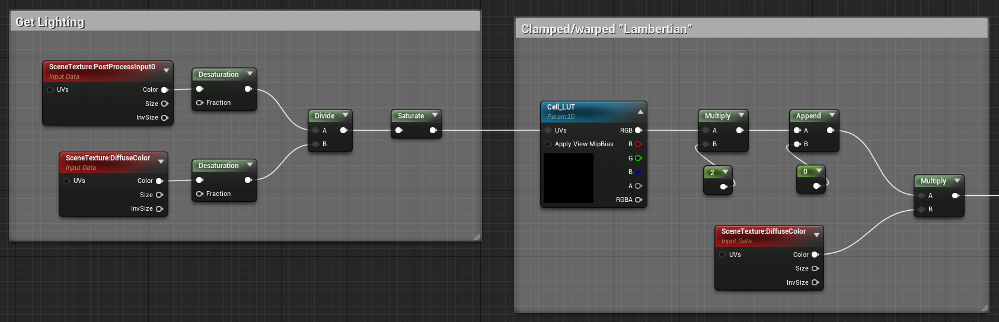
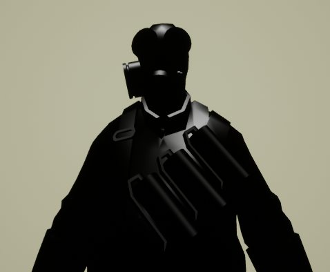

# TF2-Style Post-Processing

This is a post-processing approach to creating a similar rendering style to Valve's Team Fortress 2. Because Unreal Engine 4 uses deferred rendering, this method necessarily differs from the one given in Valve's 2007 paper on the topic.

See the paper and accompanying video:

[Illustrative Rendering in Team Fortress 2 | Paper](https://valvearchive.com/archive/Other%20Files/Publications/NPAR07_IllustrativeRenderingInTeamFortress2.pdf)

[Illustrative Rendering in Team Fortress 2 | Video](https://youtu.be/ebvbVO1QE5o)

---

Expand to see the entire post-processing material graph

  

## Breakdown

### Lighting & Colour

Expand

  

Valve's approach relies on clamped lambertian lighting, which requires access to a lighting direction.
We do not have this in deferred rendering, so the closest we can get to a pure representation of lighting is by dividing saturated versions of the lit buffer (PostProcessInput0) and the unlit scene (DiffuseColor).

This lighting then passes through a LUT texture to create the typical cell-shading dramatic terminator:

This creates the thin band of colour transition observed in commercial illustration.
In addition to shaping the lighting, this particular texture colourizes lighting, transitioning from greyscale, through a reddish region in the middle, towards a cool dark region.

---

### Rim Lighting

Expand

To help separate characters from the background, a fresnel is applied to add rim lighting to characters. 
This is only applied in regions where normals face mostly upwards; this is mostly an aesthetic choice and exploits the human instinct to assume lighting comes from above.
This has the knock-on benefit of making the upper half of each character more salient, which for Team Fortress 2's gameplay is more important than clearly seeing foot position.

---

### Interior Detailing

Expand

In addition to the rim lighting pass, Valve includes a subdued phong term intended to create some interior highlights. In-game, this helps highlight shiny, metallic objects, such as held weapons.
Like the issues discussed earlier with lambertian lighting, we have no access to a light direction with which to make phong calculations. As a substitute, we use UE4's Sky Atmosphere direction.

In this scene, the characters are without weapons, so the effect is most noticeable on leather surfaces, such as boots:

To prevent non-reflective surfaces from receiving these highlights, we use each character's specular map to mask the effect.
You can see here how the Heavy's specular allows his bald head to appear shiny, but not the interior of his face where bright highlights would look strange.

---

### Depth-Based Application

Expand

This [this video](https://youtu.be/ebvbVO1QE5o?t=106) about TF2's rendering, its stated that only characters are rendered in this style, with the world geometry being mostly diffuse textures. 
To support this isolated application of the effect, we cannot rely on applying materials to specific objects, as we are using a post-process effect. Instead,
we can only process objects that draw to custom depth.

---

### TODO

Because lighting is desaturated before being applied, coloured lighting does not work, nor does it affect the rim or phong lighting.

Unreal have added a forward rendering path, which would obviously be closer to the rendering style Source uses to render TF2. 
Its unclear what features would be lost using forward rendering.

